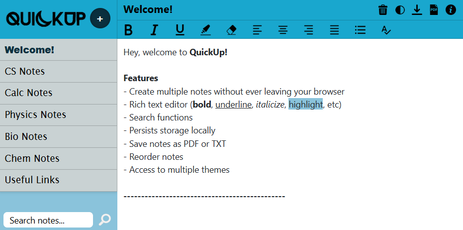

# Welcome to QuickUp!

Welcome to QuickUp, the all-in-one task manager and note creation app! This Chrome web app allows you to create dynamic notes with a rich-text-editor and save them to Chrome's local storage. No information is kept and the program is 100% secure. More info and further instructions are given in both the PDF in the root folder and by pressing the 'i' icon in the actual app.

The program is available on the [Chrome Web Store!](https://chromewebstore.google.com/detail/quickup/lafgjhgpdaejfnnihhjaggebmicabemc?hl=en)




## About QuickUp

QuickUp was one of my first projects that I made during my freshman year of university. Looking back, the code could be vastly improved, and it doesn't follow the best design principles. However, it did solve a real problem, and I actually continue to use QuickUp to this day. To put it simply, it is just super simple and a easy way to store links, copy-pasted commands, and random jot notes.

I recently decided to go back and add a few things missing from the original release. I didn't plan on spending a lot of time on it, but did bundle it together to create a "Version 1.1". The changelist is below.

### Version 1.1 Changes

- Added PDF export
- Fixed reordering bugs
- Increased contrast between theme colours


### Installing Locally

To use download QuickUp locally, follow these steps to install the extension on your Chrome browser

You can either clone the repo locally, or download the .zip file directly from the GitHub repository's webpage and extract it locally.

```
git clone https://github.com/zsspan/QuickUp
```

**Enable Developer Mode:** Open Chrome and go to ```chrome://extensions/```. Then enable Developer Mode by toggling the switch in the upper-right corner of the page.

**Load the Extension:** Click on the "Load unpacked" button and select the folder where you cloned or extracted the QuickUp repository.

**Verify Installation:** Once installed, you should see the QuickUp icon in the Chrome toolbar. If you want, you should right-click it and press "pin" to have easy access to your notes in the future.

## About

Please use the [Google Forms](https://forms.gle/vjmauWAqybCuSLW7A) page to submit any questions, feedback, or general comments :)
